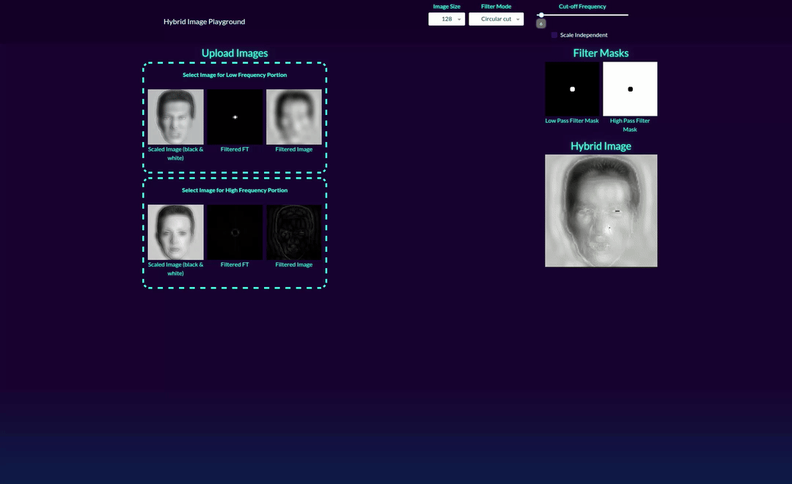

# Hybrid Image Playground


[](https://github.com/psf/black)

[](https://hub.docker.com/r/ptrlx/hybrid-image-playground)
[](https://hub.docker.com/r/ptrlx/hybrid-image-playground)



## Run the docker image

* Pull and run the docker image

  ```bash
  docker pull ptrlx/hybrid-image-playground
  docker run -it --rm -p 8080:80 ptrlx/hybrid-image-playground
  ```

* Open your browser and go to <http://localhost:8080>

## Installation

###### Requirements

* Python 3.12
* Pipenv

###### Install and run the project

* Install and run the project

  ```bash
  pipenv install
  pipenv run python src/main.py
  ```

* Open your browser and go to <http://localhost:8300>

## Jupyter Notebook

There is also a [Jupyter Notebook](jupyter/main.ipynb) available to play with Hybrid Images.

## Preprocessing - resizing and alignment

* The two images should be aligned e. g. using [GIMP](https://www.gimp.org/) (add both images as layers; reduce the opacity of the top layer; move the top layer to align with the bottom layer)
* Resize both images to the same size (and a quadratic shape)

## Resources

* <http://olivalab.mit.edu/publications/OlivaTorralb_Hybrid_Siggraph06.pdf>
* <https://github.com/rhthomas/hybrid-images>
* <https://www.geeksforgeeks.org/creating-hybrid-images-using-opencv-library-python/>
* <https://www.jeremykun.com/2014/09/29/hybrid-images/>
